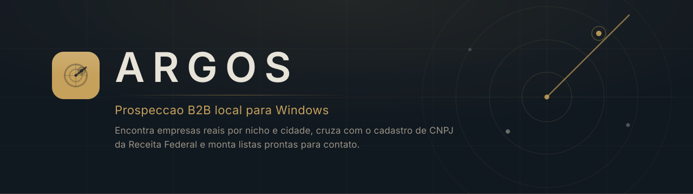
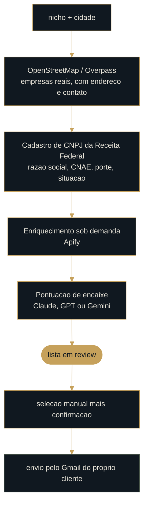

<p align="center">
  
</p>

<p align="center">
  <a href="https://argosleads.com"></a>
  
  
  
  
</p>

<p align="center">
  <sub>Esta é a vitrine pública do produto. O código-fonte é privado.</sub>
</p>

<br>

## O problema

Prospecção B2B no Brasil costuma parar em uma destas três paredes: a lista comprada
está morta, a ferramenta cobra por lead e some com a base quando você cancela, ou o
disparo automático queima o domínio do cliente na primeira semana.

O Argos foi construído contra as três.

<br>

## Como funciona

Você digita o nicho e a cidade. O Argos varre o OpenStreetMap, cruza cada empresa
encontrada com o cadastro público de CNPJ da Receita Federal, pontua o encaixe com
IA e devolve uma lista com telefone, e-mail e score.



<p align="center"><sub>A cadeia para em <code>review</code>. Nada passa daí sem alguém clicar.</sub></p>

<br>

## Três decisões que definem o produto

### O envio nunca é automático

A busca termina em `review`. O disparo exige seleção manual mais uma confirmação
explícita. Isso é decisão de produto, não limitação técnica: outreach automático é
o caminho mais curto para queimar o domínio de quem comprou e para violar a LGPD
em escala.

### Os dados do cliente ficam com o cliente

Leads, empresas, contatos, mensagens e as chaves de API vivem em SQLite na máquina
dele, com a PII cifrada por uma chave derivada da senha dele. A nuvem conhece duas
coisas apenas: **conta** e **direito de uso**.

Essa fronteira é deliberada. Subir PII de lead para um servidor nosso transformaria
o dono do produto em operador de dados pessoais de gente que nunca ouviu falar dele,
com todos os deveres que a LGPD atribui a esse papel.

### A licença é verificada localmente, não perguntada ao servidor

O direito de uso chega como um envelope assinado com Ed25519 e é conferido na
máquina, contra uma chave pública embutida no binário. O aplicativo nunca confia em
um servidor dizendo "pode entrar": quem controla a máquina aponta o domínio para
`127.0.0.1` e responde o que quiser. Uma assinatura não se falsifica assim.

<br>

## Arquitetura

```
apps/main            processo Electron: IPC, SQLite, cofre de chaves, licença
apps/preload         ponte contextBridge, superfície mínima exposta ao renderer
apps/renderer        React + Vite
packages/contracts   lógica PURA e testada: quota, licença, templates, nichos
packages/llm         um contrato para Claude, GPT e Gemini
packages/db          Drizzle + better-sqlite3
supabase/            migrações, RLS e Edge Functions (identidade e entitlement)
```

O padrão que atravessa o repositório: **lógica pura no contrato, efeito colateral no
main**. `tier.ts`, `license.ts` e `tenant.ts` não tocam disco nem rede, então rodam
em vitest sem subir o Electron. É por isso que a suíte passa de 690 testes sem
precisar abrir a aplicação.

<br>

## Stack

| Camada | O que roda |
| --- | --- |
| Desktop | Electron, React, Vite, TypeScript, Tailwind |
| Dados locais | SQLite via better-sqlite3, Drizzle, PII cifrada em AES-256-GCM |
| Nuvem | Supabase (Postgres com RLS, Auth, Edge Functions em Deno) |
| Pagamento | Stripe, com o webhook decidindo a duração pelo valor pago |
| Fontes | OpenStreetMap/Overpass, cadastro de CNPJ da Receita Federal, Apify |
| IA | Claude, GPT e Gemini atrás de um contrato único |
| Envio | Gmail API pela conta do próprio cliente, OAuth com loopback e PKCE |

<br>

## Segurança e privacidade

O repositório privado carrega o dossiê completo: modelo de ameaça, dois red teams
multiagente e a auditoria de agosto de 2026. O que dá para dizer em público:

- **Isolamento por tenant** em toda consulta, com RLS testado pela superfície real,
  usando a chave pública, que é exatamente o que um atacante tem em mãos.
- **Supressão e opt-out** como fonte de verdade antes de qualquer envio, com base
  legal registrada por campanha.
- **Exclusão de conta em cascata**, porque o direito de apagar não vale se sobrar
  cópia em tabela secundária.
- **Nenhum dado de navegação do site vai para serviço externo** enquanto não houver
  necessidade real. O script do CAPTCHA, por exemplo, só é baixado se a chave
  estiver configurada.

<br>

## Planos

Vendido por período, com um instalador só. Quem decide quantos meses a compra vale
é o servidor, olhando o valor pago, nunca um atributo que o navegador possa editar.

<p align="left">
  <a href="https://argosleads.com"></a>
</p>

<br>

---

<p align="center">
  <sub>
    Argos é um produto proprietário. Este repositório documenta o que ele faz e como
    foi construído; não distribui o código-fonte.<br>
    Feito por <a href="https://github.com/caiobelatodemartine-cmd">Caio Demartine</a>.
  </sub>
</p>
